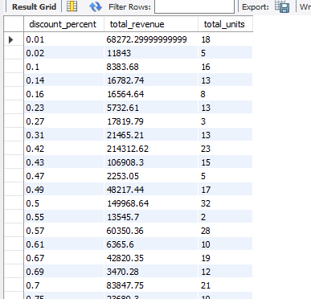

Indian E-Commerce Pricing & Revenue Analysis (SQL Project)

📌 Project Overview

- This project analyzes Indian e-commerce sales data using SQL to understand revenue trends, pricing impact, demand behavior, and regional performance.
- The goal of this project is to perform business-focused data analysis and generate actionable insights that help companies improve pricing strategy and revenue growth.
z- This project demonstrates SQL skills, business thinking, and data analysis workflow.

🎯 Business Objectives

- Analyze monthly revenue trends
- Understand impact of pricing on demand
- Identify top-performing regions
- Analyze category performance
- Identify key revenue drivers
- Generate business insights from raw data

🛠 Tools & Technologies Used

- MySQL
- SQL
- Data Analysis
- GitHub (Project Documentation)

📊 Dataset Information

Dataset: Indian E-commerce Pricing Revenue Growth

Records: 30,600 rows

Columns:

- order_id
- order_date
- state
- zone
- category
- brand_type
- customer_gender
- customer_age
- base_price
- discount_percent
- final_price
- units_sold
- revenue
- sales_event
- competition_intensity
- inventory_pressure

🔍 Project Workflow

1.  Data Cleaning & Preparation
- Imported CSV dataset into MySQL
- Converted order_date from text to DATE format
- Validated data types
- Checked for missing values

2. Monthly Revenue Trend Analysis
- Calculated monthly revenue
- Analyzed month-over-month revenue growth
- Identified revenue fluctuations over time

Key Insights:
- The revenue shows cyclical fluctuations rather than steady growth. 
- The highest revenue occurred in June 2023, and seasonal spikes are visible around June and September, indicating possible seasonal demand. 
- Overall, the business experiences month-to-month variations instead of consistent increasing or decreasing trends.

3. Month-to-Month Revenue growth %
- Calculated previous month revnue
- growth rate
- Business trend Indicator

Key Insights:
- Revenue shows seasonal fluctuations with strong growth around mid-year months and periodic declines afterward. 
- The highest growth occurred in June 2024 (14.12%), while the largest drop was in July 2023 (-12.03%), indicating cyclical demand behavior rather than steady growth.

4. Discount Impact on revenue

Observed:
- Does higher discount → more units sold?
- Does revenue increase or decrease?
- Is there an optimal discount range?

Key Insights:
- Sales and revenue increase significantly with higher discounts. Customer demand is highly price sensitive. 
- The optimal discount range appears between 6%–11%, where both revenue and units sold peak. 
- Very low discounts generate minimal sales, indicating aggressive discount strategies drive business performance.

5. Pricing vs Demand Relationship

- Analyzed relationship between price and units sold
- Grouped pricing into different price ranges
- Compared demand across pricing levels

Key Insights:
- Pricing analysis shows a strong negative relationship between price and demand, indicating customers are highly price sensitive. 
- However, revenue peaks in the mid-price range (₹1500–₹2500), suggesting an optimal pricing strategy. 
- Lower prices drive high volume but lower revenue, while premium pricing targets a smaller customer segment.

6. Top performing States

- Compared revenue by state
- Identified high revenue generating regions

Key Insights:
- Regional analysis shows Delhi NCR, Maharashtra, and Karnataka are the highest revenue generating markets due to strong demand and high purchasing power. 
- Sales performance is concentrated in urban regions, while states like Uttar Pradesh and West Bengal present growth opportunities due to lower revenue despite large populations.

7. Product Category Performance Analysis
- Compared revenue and units sold across product categories

Key Insights:
- Product category analysis shows Premium Lifestyle and Electronics generate the highest revenue, indicating strong contribution from high-priced products. 
- Grocery Essentials and Beauty categories show high sales volume but low revenue, suggesting a volume-based pricing strategy. 
- The business relies heavily on premium product segments for revenue growth while maintaining mass-market categories for consistent demand.

8. Revenue Drivers Analysis
- Evaluated impact of pricing level and demand level on revenue

Key Insights:
- Revenue driver analysis shows that pricing and demand individually do not strongly determine revenue. 
- Surprisingly, low-priced products with low demand generated the highest revenue, suggesting bulk purchasing behavior or high transaction values. 
- The findings indicate that revenue is influenced more by customer purchasing patterns and order size rather than price or demand alone.

📈 Business Insights Summary

- Pricing significantly affects customer demand
- Premium categories generate maximum revenue
- Certain regions consistently outperform others
- Revenue is influenced by multiple factors beyond price
- Customer purchasing behavior is a key revenue driver

🚀 Skills Demonstrated

- SQL data cleaning
- Aggregate functions
- GROUP BY analysis
- Business problem solving
- Revenue analysis
- Pricing analysis
- Data interpretation
- Analytical thinking

👤 Author

Abdul Mujeeb  
